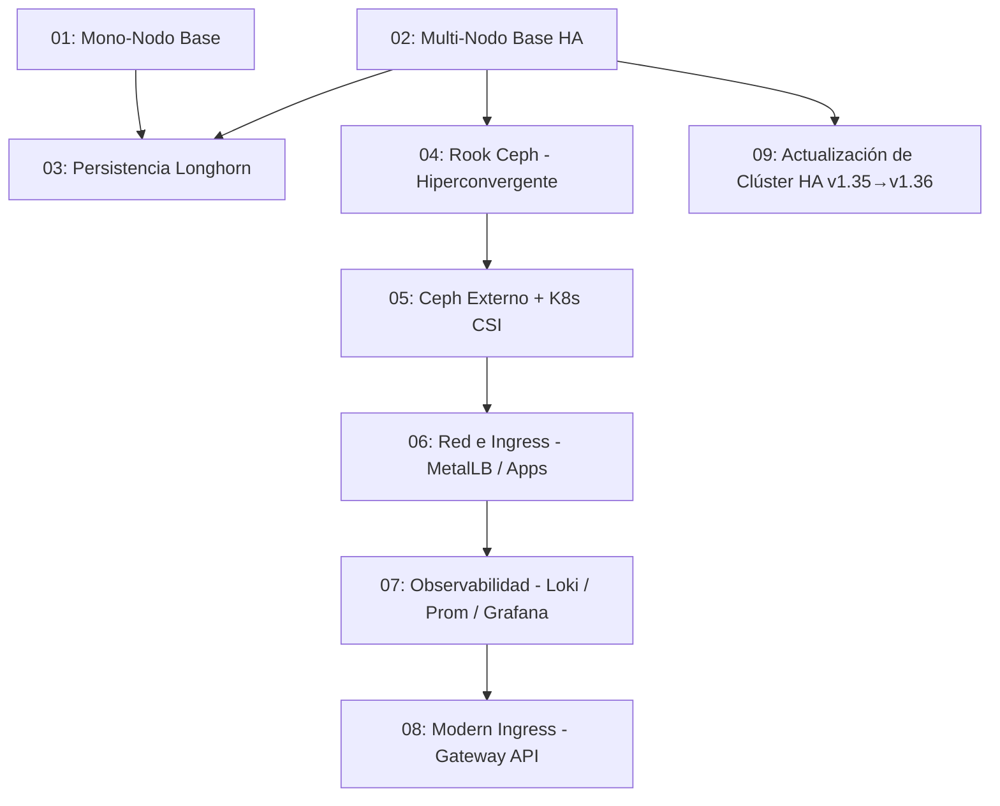

# 🗺️ Plan de Ruta de Laboratorios Kubernetes en LXD

Este archivo detalla la secuencia de laboratorios prácticos diseñados para ser ejecutados utilizando automatizaciones de Ansible sobre infraestructura local de Máquinas Virtuales LXD en Ubuntu 26.04.

---

## Cosas a comprobar
 - Que se usan siempre los modulos más idempotentes: sobre todo los de k8s y helm
 - en los ejemplos 02 03 04 y 05 hay que meter playbook que permitan añadir un nuevo nodo al cluster y otro para quitarlo de manera segura. en el caso de el 03 04 y 05 deben de ser a parte un nodo de almancenamiento. tambien deberemos meter la manera de quitar un nodo de almacenamiento.

## ✅ Estado de Validación de los Laboratorios

Cada laboratorio se marca como validado únicamente tras completar el ciclo descrito en [[idempotencia]] (`.agents/rules/idempotencia.md`): despliegue completo desde cero (`run_all.sh`) y una segunda ejecución consecutiva sin cambios espurios, más `destroy_all.sh` limpio.

| Laboratorio | Validado | Fecha | Notas |
| --- | --- | --- | --- |
| 01. Mono-Nodo Base | ✅ Validado | 2026-07-16 | 2 ejecuciones consecutivas OK (exit 0, changed=0 en todas las tareas). Nodo y pods sanos confirmados manualmente por el usuario (kubectl get nodes/pods, Nginx/Apache/Headlamp respondiendo 200). |
| 02. Multi-Nodo Base HA | ✅ Validado | 2026-07-16 | 2 ejecuciones consecutivas OK (exit 0, changed=0 salvo cambios esperados). Nodos y pods sanos confirmados manualmente por el usuario (kubectl get nodes/pods, eventos de CoreDNS revisados). Pendiente issue menor no bloqueante: `helm_repository force_update: true` en `11_desplegar_headlamp.yml` reporta `changed` en cada ejecución. |
| 03. Persistencia Longhorn | ✅ Validado | 2026-07-16 | 2 ejecuciones de `run_all.sh` desde cero (exit 0, changed=0 salvo cambios esperados) + ciclo completo de escalado probado (`add_node`→`integrar_nodo_longhorn`→`eliminar_nodo`), nodo añadido/etiquetado/eliminado sin dejar residuos. Se añadió `11_desplegar_headlamp.yml` (antes ausente) y se rediseñó el escalado con almacenamiento por defecto (opt-out en `[new_workload_workers]`). Bug real encontrado y corregido en `13_integrar_nodo_longhorn.yml`: usaba `kubernetes.core.k8s` con `hosts: first_manager`, que requiere la librería Python `kubernetes` en el nodo remoto (no instalada); corregido a `hosts: localhost` + kubeconfig descargado, igual que el resto de tareas de este tipo. |
| 04. Rook Ceph Hiperconvergente | ✅ Validado | 2026-07-16 | 2 ejecuciones de `run_all.sh` (exit 0) + ciclo completo de escalado probado dos veces (`add_node`→`integrar_nodo_rook_ceph`→`eliminar_nodo`), terminando en `HEALTH_OK` sin intervención manual. Bugs reales encontrados y corregidos: (1) jsonpath mal formado en `09_desplegar_rook_ceph.yml` que bloqueaba el despliegue; (2) `{{ item }}`/`{{ cmd }}` indefinidos en tareas `lxc exec` de los `add_node.yml` de los labs 02/03/04/05; (3) `become: true`+`delegate_to: localhost` sin `become: false` en el guardado/lectura de `join_command.txt` de los mismos 4 labs (pedía sudo local); (4) falta de `force_stop`/`timeout` al destruir la VM en los `eliminar_nodo.yml` de los mismos 4 labs; (5) `15_eliminar_nodo.yml` del lab 04 no purgaba el OSD de Ceph antes de destruir la VM (dejaba `HEALTH_WARN`) — añadidos `ceph osd out`/`purge`, limpieza de Deployment residual, flag `noout` y bucket CRUSH vacío. |
| 05. Ceph Externo + K8s CSI | ⬜ Pendiente de validación del usuario | 2026-07-16 | 2 ejecuciones de `run_all.sh` desde cero (exit 0) + ciclo completo de escalado (`add_node`→`integrar_nodo_ceph_externo`→`eliminar_nodo`, tanto worker K8s como OSD Ceph) probado varias veces hasta quedar reproducible sin intervención manual, terminando en `HEALTH_OK`. Bugs reales encontrados y corregidos: (1) el paquete `cephadm` de Ubuntu no crea el usuario/grupo `ceph` con UID/GID 167 que esperan los contenedores — se crea explícitamente antes de instalar `cephadm`; (2) faltaban los paquetes `python3-ceph-common` y `ceph-common` (CLI); (3) el chequeo de OSDs listos parseaba texto humano frágil (`'3 osds: 3 up, 3 in'`) que cambió de formato en versiones nuevas de Ceph — migrado a `ceph osd stat -f json`; (4) la `StorageClass` tenía el `provisioner` mal (prefijo `ceph-csi.` de más) y un `pool` inexistente (`device_health_metrics`) — creado un pool RBD real; (5) la integración CSI usaba el `configMap` clásico en vez de las CRDs `CephConnection`/`ClientProfile` que requiere el chart basado en operador; (6) al escalar, faltaba instalar `cephadm`/motor de contenedores y distribuir la clave SSH de Ceph en el nuevo nodo OSD (solo se hacía en el despliegue inicial); (7) **el orden de `15_eliminar_nodo.yml` estaba invertido**: `ceph osd purge` no se aplica de forma duradera mientras el demonio del OSD siga vivo, incluso marcado `out --force` — corregido para destruir la VM *antes* de purgar Ceph (con reintentos), y `ceph orch host rm` ahora usa `--offline --force` porque el host ya está físicamente destruido en ese punto; (8) `delegate_to` hacia el monitor Ceph no funcionaba dentro de un play con `connection: local` (las órdenes se ejecutaban en la máquina de control, no en el clúster) — añadido `ansible_connection: ssh` explícito; (9) `20_destroy.yml` de este lab (y de 02/03/04) nunca destruía nodos escalados (`new_workers`/`new_ceph_osds`) si el usuario los añadía y no los quitaba antes de destruir todo — corregido en los 4 labs. |
| 06. Red e Ingress (MetalLB) | ⬜ Pendiente de validación del usuario | 2026-07-16 | 2 ejecuciones de `run_all.sh` desde cero (exit 0, changed=0 en la segunda salvo el `force_update` conocido de Headlamp) + ciclo completo de escalado (`add_node`/`eliminar_nodo`) probado sin problemas. Verificado el enrutamiento por nombre de host (`app-a.k8s.local`/`app-b.k8s.local`, HTTP 200 cada uno con su contenido correcto vía la IP LoadBalancer asignada por MetalLB). Bug real encontrado y corregido en `11_desplegar_apps_demo.yml`: el comando del contenedor incluía `API_KEY: $API_KEY` (dos puntos + espacio), que YAML interpretó como un mapa clave-valor en vez de una cadena de texto, rompiendo el campo `command` (debía ser una lista de strings). Corregido a `API_KEY=$API_KEY` entrecomillado. |
| 07. Observabilidad (Loki/Prom/Grafana) | ⬜ Pendiente de validación del usuario | 2026-07-16 | 2 ejecuciones de `run_all.sh` desde cero (exit 0, changed=0 en la segunda salvo el `force_update` conocido de Headlamp). Verificado: 51 métricas `up` en Prometheus, Grafana sano, Loki recibiendo logs de 20+ jobs (vía Promtail), 75 pods sanos, todo con persistencia real en Longhorn (Prometheus, Alertmanager, Grafana, Loki). Sin escalado de nodos en este lab (no aporta valor pedagógico aquí, ya cubierto en 02-06). Bugs/ajustes reales encontrados y corregidos: (1) el pool de caché `memcached` de Loki (`chunksCache`/`resultsCache`) no cabía en los workers (`Insufficient memory`) — deshabilitado, innecesario en modo *single binary* de un solo Pod; (2) el volumen de Longhorn para Loki quedaba `faulted`/`ReplicaSchedulingFailure` por falta de espacio en disco al competir con los volúmenes de Prometheus/Alertmanager — se subió el disco de los workers de 20GB a 40GB (también se subió la RAM de 3GB a 4GB por el mismo motivo de recursos). |
| 08. Modern Ingress (Gateway API) | ⬜ Pendiente | — | |
| 09. Actualización de Clúster HA (v1.35→v1.36) | ⬜ Pendiente | — | Idea acordada con el usuario, aún sin implementar. |

Actualizar esta tabla (marcar ✅ y fecha) cada vez que un laboratorio complete su ciclo de validación de dos ejecuciones.

## 🚦 Roadmap de Escenarios

---

## 📂 Descripción de los Laboratorios

### 🟢 01. Mono-Nodo Kubernetes Base (`01_k8s_base_un_nodo`)
*   **Enfoque:** Infraestructura mínima de un solo nodo (`k8s-single`) actuando como plano de control y plano de datos.
*   **Conceptos:** Containerd CRI, kubeadm init, red de pod CNI (Flannel), remoción de control-plane taint, y exposición básica por NodePort.

### 🟢 02. Multi-Nodo Kubernetes Base HA (`02_k8s_base_ha_3_managers_3_workers`)
*   **Enfoque:** Clúster de alta disponibilidad con 3 Managers + 3 Workers, sin punto único de fallo en el plano de control.
*   **Conceptos:** VIP del plano de control gestionada por **kube-vip** (pod estático con ARP + leader-election en cada manager, sin VMs de balanceador externo), `kubeadm init --control-plane-endpoint --upload-certs` en el primer manager, unión de managers adicionales vía `--certificate-key`, unión dinámica de workers vía el VIP, persistencia de variables locales (`join_command.txt`, `certificate_key.txt`), y una prueba de resiliencia HA dedicada (caída y recuperación de un worker y del manager que hizo el `kubeadm init` inicial).

### 🟢 03. Almacenamiento Distribuido Longhorn (`03_k8s_ha_almacenamiento_persistente_longhorn`)
*   **Enfoque:** Despliegue de Longhorn como motor de almacenamiento persistente distribuido, sobre el clúster HA del laboratorio 02 (3 managers, 2 workload workers, 3 storage dedicados). Reutiliza los playbooks base de infraestructura y bootstrap del 02 vía `import_playbook`.
*   **Conceptos:** open-iscsi y nfs-common en nodos, instalación de Longhorn con Helm, configuración de StorageClass, PVCs de tipo RWO/RWX, panel de administración web de Longhorn expuesto por NodePort (accesible vía la VIP), y aislamiento físico de réplicas en nodos de almacenamiento mediante Taints y Tolerancias.

### 🔵 04. Rook Ceph Hiperconvergente (`04_k8s_ha_almacenamiento_persistente_rook_ceph`)
*   **Enfoque:** Aprovisionamiento de un clúster de Ceph gestionado e integrado directamente dentro de Kubernetes a través del operador Rook, sobre el clúster HA del laboratorio 02 (3 managers, 3 workers con disco OSD). Reutiliza los playbooks base de infraestructura y bootstrap del 02 vía `import_playbook`.
*   **Conceptos:** Operador Rook, Custom Resource Definitions (CRDs) de Ceph (`CephCluster`, `CephBlockPool`, `CephFilesystem`), asignación automática de discos virtuales en caliente en VMs LXD, aprovisionamiento dinámico de volúmenes persistentes RBD (RWO) y CephFS (RWX) nativos de Kubernetes, y Prometheus conectado al Ceph Dashboard.

### 🔵 05. Clúster Ceph Externo y Conexión K8s (`05_k8s_ha_almacenamiento_persistente_externo_ceph`)
*   **Enfoque:** Similar al 04, pero sobre el clúster HA del laboratorio 02 (3 managers, 3 workers). Despliegue de un clúster de Ceph independiente en 3 VMs LXD dedicadas usando `cephadm`. Conexión del clúster de Kubernetes HA a este almacenamiento unificado.
*   **Conceptos:** Inicialización de Ceph con `cephadm`, configuración de OSDs en discos adicionales, inyección de credenciales y *endpoints* de Ceph en Kubernetes, despliegue del driver Ceph CSI y consumo de almacenamiento RBD/CephFS de forma externa y segura.

### 🟡 06. Red y Acceso Externo (`06_k8s_red_ingress_metallb`)
*   **Enfoque:** Similar al 04. Exposición de servicios de producción local usando IPs dedicadas y enrutamiento HTTP por nombres de dominio.
*   **Conceptos:** MetalLB (LoadBalancer L2 local), NGINX Ingress Controller, consolidación de microservicios, parametrización con `ConfigMaps`/`Secrets` e inicializadores `initContainers`.

### 🟡 07. Observabilidad Completa (`07_k8s_observabilidad_loki_grafana_prometheus`)
*   **Enfoque:** Similar al 06. Recolección centralizada de métricas y logs del clúster con persistencia de bases de datos.
*   **Conceptos:** Prometheus Operator (métricas), Grafana (visualización), Loki (agregación de logs) y Promtail. Almacenamiento de bases de datos persistentes en el almacenamiento de Ceph/Longhorn.

### 🟡 08. Gateway API (`08_k8s_gateway_api`)
*   **Enfoque:** Similar al 07. Implementación de la nueva especificación moderna de enrutamiento en Kubernetes sobre el clúster HA ya existente desde el laboratorio 02 (no se construye alta disponibilidad de nuevo, se hereda).
*   **Conceptos:** Envoy Gateway/Cilium, `GatewayClass`, `Gateway` y `HTTPRoute`. División de tráfico Canary.

### 🟣 09. Actualización de Clúster HA (`09_k8s_actualizacion_cluster_ha`)
*   **Enfoque:** Reutiliza la arquitectura HA del laboratorio 02 (3 managers + 3 workers, kube-vip), pero desplegada inicialmente en Kubernetes **v1.35**. El laboratorio ejecuta después el proceso oficial de actualización de `kubeadm` a **v1.36**, nodo a nodo, sin downtime.
*   **Conceptos:** `kubeadm upgrade plan`/`upgrade apply` en el primer manager, `kubeadm upgrade node` en el resto de managers, `kubectl drain`/actualización de `kubelet`+`kubectl` (liberando el `apt hold` de versión)/`kubectl uncordon` por cada nodo, y verificación de que la VIP (kube-vip) y la disponibilidad del API server no se interrumpen durante todo el proceso — reutilizando el mismo patrón de prueba de disponibilidad ya usado en la prueba de resiliencia HA del laboratorio 02.
*   **Estado:** idea acordada con el usuario (2026-07-16), pendiente de implementar.
