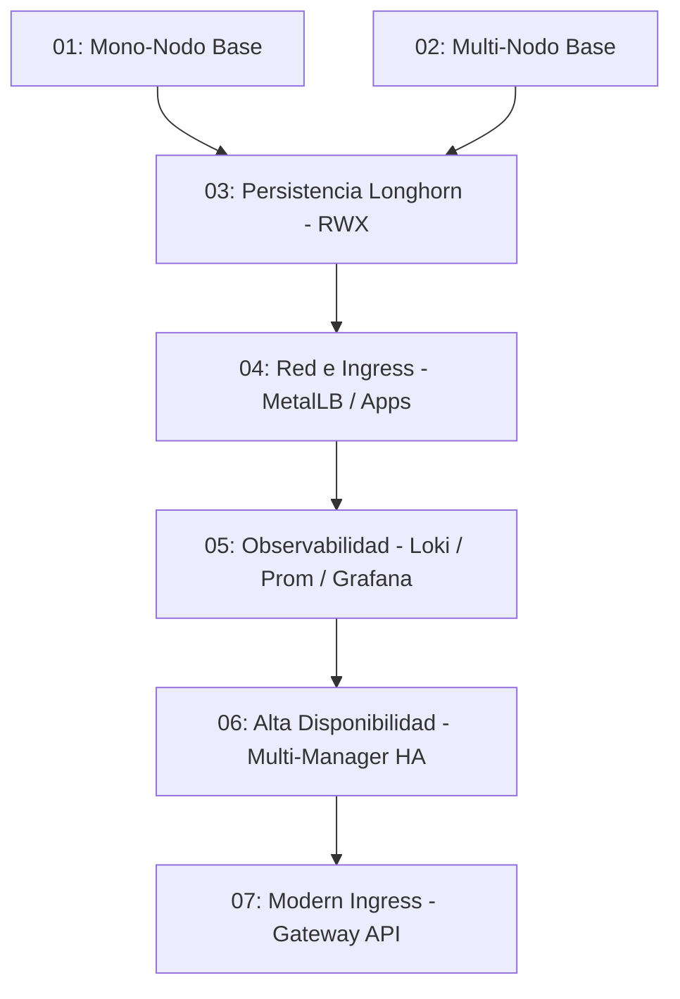

# 🗺️ Plan de Ruta de Laboratorios Kubernetes en LXD

Este archivo detalla la secuencia de laboratorios prácticos diseñados para ser ejecutados utilizando automatizaciones de Ansible sobre infraestructura local de Máquinas Virtuales LXD en Ubuntu 26.04.

---

## Cosas a comprobar
 - Que se usan siempre los modulos más idempotentes: sobre todo los de k8s y helm

## 🚦 Roadmap de Escenarios

---

## 📂 Descripción de los Laboratorios

### 🟢 01. Mono-Nodo Kubernetes Base (`01_k8s_base_un_nodo`)
*   **Enfoque:** Infraestructura mínima de un solo nodo (`k8s-single`) actuando como plano de control y plano de datos.
*   **Conceptos:** Containerd CRI, kubeadm init, red de pod CNI (Flannel), remoción de control-plane taint, y exposición básica por NodePort.

### 🔵 02. Multi-Nodo Kubernetes Base (`02_k8s_base_1_manager_2_workers`)
*   **Enfoque:** Clúster básico con separación de roles (1 Manager + 2 Workers).
*   **Conceptos:** Unión dinámica de nodos workers mediante tokens generados en caliente, persistencia de variables locales (`join_command.txt`), y distribución de cargas de trabajo.

### 💾 03. Almacenamiento Distribuido Longhorn (`03_k8s_almacenamiento_persistente_longhorn`)
*   **Enfoque:** Aparte de lo del 03. 3 nodos de almacenamiento. Despliegue de Longhorn como motor de almacenamiento persistente distribuido dentro de Kubernetes para dar soporte a volúmenes dinámicos tanto de lectura exclusiva de un nodo (**ReadWriteOnce - RWO**) como compartidos multi-nodo (**ReadWriteMany - RWX**).
*   **Conceptos:** open-iscsi y nfs-common en nodos, instalación de Longhorn con Helm, configuración de StorageClass, PVCs de tipo RWO/RWX, panel de administración web de Longhorn expuesto por NodePort, y pruebas de persistencia concurrentes.

### 🌐 04. Red y Acceso Externo (`04_k8s_red_ingress_metallb`)
*   **Enfoque:** Aparte de lo del 03. Exposición de servicios de producción local usando IPs dedicadas y enrutamiento HTTP por nombres de dominio.
*   **Conceptos:** MetalLB (LoadBalancer L2 local), NGINX Ingress Controller, consolidación de microservicios, parametrización con `ConfigMaps`/`Secrets` e inicializadores `initContainers`.

### 📊 05. Observabilidad Completa (`05_k8s_observabilidad_loki_grafana_prometheus`)
*   **Enfoque:** Aparte de lo del 04. Recolección centralizada de métricas y logs del clúster con persistencia de bases de datos.
*   **Conceptos:** Prometheus Operator (métricas), Grafana (visualización), Loki (agregación de logs) y Promtail. Almacenamiento de bases de datos persistentes en la StorageClass de Longhorn del Escenario 03.

### 🛡️ 06. Alta Disponibilidad (HA Clúster) (`06_k8s_alta_disponibilidad_ha`)
*   **Enfoque:** Aparte de lo del 05. Clúster de producción local redundante resistente a la pérdida de nodos managers.
*   **Conceptos:** Clúster multi-manager (3 Managers + 2 Workers), etcd distribuido, y balanceador externo con HAProxy/Keepalived.

### 🔌 07. Gateway API (`07_k8s_gateway_api`)
*   **Enfoque:** A parte de lo del 06. Implementación de la nueva especificación moderna de enrutamiento en Kubernetes sobre el clúster en alta disponibilidad.
*   **Conceptos:** Envoy Gateway/Cilium, `GatewayClass`, `Gateway` y `HTTPRoute`. División de tráfico Canary.
