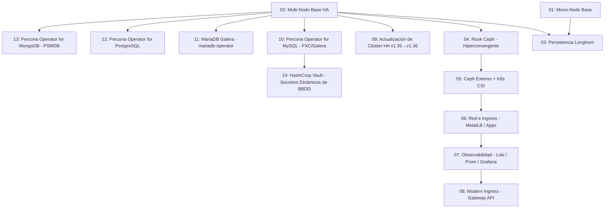

# 🗺️ Plan de Ruta de Laboratorios Kubernetes en LXD

Este archivo detalla la secuencia de laboratorios prácticos diseñados para ser ejecutados utilizando automatizaciones de Ansible sobre infraestructura local de Máquinas Virtuales LXD en Ubuntu 26.04.

---

## Cosas a comprobar
 - Que se usan siempre los modulos más idempotentes: sobre todo los de k8s y helm
 - en los ejemplos 02 03 04 y 05 hay que meter playbook que permitan añadir un nuevo nodo al cluster y otro para quitarlo de manera segura. en el caso de el 03 04 y 05 deben de ser a parte un nodo de almancenamiento. tambien deberemos meter la manera de quitar un nodo de almacenamiento.
 - Se ha subido `kube_vip_image` de `v0.8.9` a `v1.2.1` (salto de versión mayor) en los escenarios 02-08 (todos los que usan kube-vip). Solo se ha vuelto a probar el arranque HA con la nueva versión en el escenario 08 (en curso). Pendiente revisar/volver a probar el arranque de kube-vip v1.2.1 en los escenarios 02, 03, 04, 05, 06 y 07.
 - Desplegar Headlamp lo antes posible dentro de cada laboratorio (justo después de que el clúster esté formado y el CNI funcionando, antes del resto de despliegues específicos del lab) para poder seguir desde la consola web el resto de despliegues a medida que se ejecutan. Aplicado ya en todos los laboratorios (01-10); renumerados los playbooks afectados en cada uno. Pendiente volver a probar labs 01-07 con el nuevo orden (no re-ejecutados tras el cambio, salvo comprobación de que la renumeración es consistente).
 - Se ha añadido una variable de versión explícita en `group_vars` para todo el software de plataforma Kubernetes en todos los laboratorios (charts de Helm: Headlamp, Longhorn, MetalLB, NGINX Ingress, kube-prometheus-stack, Loki/Promtail, Rook Ceph, ceph-csi-operator, Percona, Cilium; e imágenes clave como `quay.io/ceph/ceph`), en vez de dejar que cada `helm install` tome silenciosamente "lo último disponible" en cada ejecución. No se ha vuelto a probar el arranque completo de los laboratorios 01-07 con las versiones ahora fijadas explícitamente (antes no fijadas) — pendiente de revalidación.

## 🎓 Lecciones Aprendidas (errores recurrentes a no repetir)

Estas son las clases de error que ya han aparecido más de una vez (o que fueron especialmente costosas) a lo largo de varios laboratorios. Antes de escribir una tarea Ansible nueva que encaje en alguno de estos patrones, revisar esta lista.

- **`ansible.builtin.command` rompe las comillas dobres embebidas en expresiones `jsonpath`**: usa `shlex.split()` (no hay shell real), así que un jsonpath como `-o jsonpath={.items[?(@.spec.nodeID=="valor")]}` pierde las comillas dobles y el filtro deja de funcionar (falla en silencio o con "non-zero return code"). **Fix**: envolver SIEMPRE la expresión jsonpath completa entre comillas simples (`-o 'jsonpath={...=="valor"...}'`). Ha aparecido en los labs 04, 05 y 10.
- **Un `command: >` (bloque plegado YAML) con un script Python multilínea (`python3 -c "..."`) produce `IndentationError`**: si la comilla de apertura va seguida de un salto de línea, el plegado de YAML deja un espacio en blanco antes de la primera sentencia real. **Fix**: aplanar el script Python completo a una sola línea fuente. Apareció en el lab 10 (`14_verificar_pxc.yml`).
- **`image: {{ variable }}` sin comillas es YAML ambiguo** (se confunde con la sintaxis de mapa en línea `{ }`). **Fix**: comillas siempre alrededor de cualquier valor que empiece por `{{ `: `image: "{{ variable }}"`.
- **Los operadores de bases de datos (Percona PXC, y previsiblemente MariaDB/PostgreSQL/MongoDB en los labs 11-13) tienen validaciones de "safe defaults" que rechazan la configuración ENTERA sin crear ningún Pod** (p.ej. PXC exige `haproxy.size >= 2` y `pxc.size` IMPAR por quórum Galera) — no siempre están documentadas de antemano, se descubren en tiempo de ejecución (`status.state: error`). **Cómo aplicar**: al parametrizar el tamaño de un clúster de BBDD, comprobar primero si el operador exige un tamaño mínimo o una paridad concreta, y diseñar el escalado en los incrementos que esa paridad exija (en PXC, de 2 en 2, nunca de 1 en 1).
- **Un `StatefulSet` NO borra los PVC de los ordinales que salen al reducir su tamaño** (comportamiento por defecto de Kubernetes) — quedan huérfanos y hay que borrarlos explícitamente. **Grave**: si el cálculo de qué ordinales están "huérfanos" se basa en leer el tamaño ACTUAL del recurso en cada ejecución (para poder ser idempotente) en vez de en el tamaño ANTES de la propia reducción, una reejecución del playbook (cuando la reducción ya se hizo en una ejecución anterior) calculará mal los ordinales salientes y borrará el PVC de una réplica ACTIVA en vez de la huérfana. Solo el finalizer `kubernetes.io/pvc-protection` de Kubernetes evita el borrado inmediato mientras un Pod siga usando ese PVC — pero en cuanto ese Pod se recree, Kubernetes completa el borrado y (con `reclaimPolicy: Delete`) destruye el volumen de Longhorn, perdiendo esa réplica de datos. Ocurrió de verdad en el lab 10 (`17_eliminar_nodos.yml`) y solo se detectó revisando manualmente el estado de los PVC tras la ejecución, no por ningún fallo visible en el PLAY RECAP. **Fix**: cualquier tarea de "borrar recurso huérfano tras un escalado hacia abajo" que dependa de una guarda de idempotencia (tipo `pxc_ya_reducido`) debe llevar el mismo `when` que las tareas de escalado que calculan esos ordinales — nunca ejecutarse incondicionalmente "por si acaso" cuando el cálculo de qué borrar depende de un estado que ya cambió.
- **El Pod `instance-manager` de Longhorn NO es un `DaemonSet` real** (es un recurso `InstanceManager` propio de Longhorn) y tiene su propio `PodDisruptionBudget` con 0 disrupciones permitidas mientras gestione algún volumen — `kubectl drain --ignore-daemonsets` se queda colgado indefinidamente si no se desaloja Longhorn de ese nodo ANTES de drenarlo. Tampoco se autolimpia solo aunque gestione cero réplicas reales (solo se limpia cuando el nodo se marca "down"). **Fix**: comprobar con `kubectl get replicas.longhorn.io` que el nodo tiene cero réplicas reales, desactivar `allowScheduling` en el nodo, y borrar el Pod `instance-manager` con un `kubectl delete pod` directo (no una eviction) — el borrado directo no respeta el PDB, a diferencia del `drain`. Apareció primero en el lab 03, recurrió en el lab 10.
- **Al probar disponibilidad de una BBDD durante una operación de escalado/drenado, el Pod-sonda debe fijarse (`nodeName` en el override) a un nodo que NO vaya a ser drenado/eliminado durante la prueba** — si no, la sonda se convierte en daño colateral y genera un falso "FAIL" que no tiene nada que ver con la disponibilidad real del servicio. Apareció en el lab 10.
- **Metodología de descubrimiento de versiones**: no fiarse de versiones "de memoria/entrenamiento" para charts de Helm ni imágenes — consultar `https://<repo>/index.yaml` (vía `curl | python3 -c "import yaml; ..."`) y la API de releases de GitHub para obtener la última versión estable real antes de fijarla en `group_vars`.
- **Kubernetes normaliza el nombre de imagen añadiendo el registro por defecto** (`docker.io/`) en `pod.status.containerStatuses[].image`, aunque en el `spec` original (del Pod o de un CRD) se haya referenciado sin ese prefijo (`percona/...` en vez de `docker.io/percona/...`). Cualquier tarea que espere a que un Pod ejecute ya una imagen concreta comparando por IGUALDAD exacta contra la cadena tal como se escribió en `group_vars` nunca coincidirá — hay que comparar por subcadena (`variable in stdout`), no por igualdad. Apareció en el lab 10 (`18_actualizar_motor_pxc.yml`).
- **Antes de ejecutar un playbook nuevo que toque `ansible.builtin.command` con `jsonpath`, revisar esta misma lista de lecciones aprendidas primero**: el bug de comillas en jsonpath (ver más arriba) reapareció en `18_actualizar_motor_pxc.yml` en la MISMA sesión en la que se documentó por primera vez de forma explícita — un fichero nuevo escrito después de identificar el patrón todavía lo repitió, por no contrastarlo contra la lista antes de lanzarlo.
- **La documentación pública de un operador puede no mencionar una validación real que sí existe en tiempo de ejecución** (o viceversa): antes de diseñar un flujo de escalado (incrementos de 1 en 1 vs. de 2 en 2 por paridad, tamaños mínimos, etc.) basándose en lo que dice la documentación, probarlo en vivo contra el webhook/API real del operador. Ocurrió en el lab 11 (`mariadb-operator`): varias búsquedas no confirmaron que exigiera un tamaño impar de réplicas para Galera, pero el webhook de validación sí lo rechaza en tiempo real con un mensaje explícito de "split brain" — igual que Percona, aunque no estaba documentado de la misma forma.
- **Un operador puede aprovisionar MÁS de un PVC por réplica** (no asumir que solo existe el volumen de datos obvio): `mariadb-operator` crea un PVC de datos (`storage-`) Y otro de configuración de Galera (`galera-`) por cada Pod. Si al limpiar huérfanos tras un escalado hacia abajo solo se borra el PVC "obvio", el otro mantiene viva una réplica real de Longhorn en el nodo saliente indefinidamente (mismo síntoma que el bug de PVC huérfano del escenario 10, causa distinta) — siempre comprobar con `kubectl get pvc -n <namespace>` cuántos PVC existen realmente por réplica antes de escribir la lógica de limpieza, en vez de asumirlo por analogía con otro operador.
- **Un operador de Galera puede tener su propia recuperación automática de "split brain" tras un escalado hacia abajo, y puede tardar varios minutos**: al eliminar réplicas de golpe, la vista persistida de Galera (`gvwstate`) en los nodos supervivientes puede seguir contando los miembros retirados como "partitioned" en vez de "removido a propósito", quedando temporalmente en estado `NON_PRIM` (sin quórum) hasta que el operador lo detecte y fuerce una reconciliación. No es un cuelgue: comprobarlo con los logs del propio operador (buscar un logger tipo "recovery"/"galera") antes de asumir que algo se ha roto, y esperar con reintentos generosos (varios minutos) a que el estado vuelva a `Synced` antes de dar la operación por fallida.
- **El helper `fullname` de un chart de Helm no siempre usa el nombre del release tal cual**: muchos charts (patrón estándar de Helm) solo lo usan literal si YA contiene el nombre del propio chart; si no, lo concatenan (`<release>-<chart>`), dando nombres de recursos distintos a los esperados (p.ej. `pg-cluster-pg-db` en vez de `pg-cluster`). Comprobar siempre los nombres de recursos reales tras el primer despliegue (`kubectl get all`), no asumirlos por el nombre de release pasado a `helm install`; si hace falta un nombre exacto y predecible, forzarlo con `fullnameOverride` en los `values`. Apareció en el lab 12 (`pg-db`).
- **No asumir qué Service concreto de varios creados por un chart es el que recibe la IP `LoadBalancer`**: un chart puede crear varios Services relacionados (`-ha`, `-pgbouncer`, `-primary`, `-replicas`...) y el que realmente lleva `type: LoadBalancer` puede no ser el que su nombre sugeriría a primera vista. Comprobar con `kubectl get svc` cuál tiene una IP externa real antes de referenciarlo en otros playbooks. Apareció en el lab 12 (`pg-db`: el LB real es `<cluster>-ha`, no `<cluster>-pgbouncer`).
- **Un `helm uninstall` no borra los PVC** (comportamiento por defecto, igual que un `StatefulSet` al reducir su tamaño) — si se reinstala el mismo release tras un `uninstall` (p.ej. para corregir un nombre de recurso mal puesto), los PVC del intento anterior quedan huérfanos y compiten por espacio en disco con los nuevos, pudiendo hacer fallar el aprovisionamiento de los nuevos volúmenes con "insufficient storage" sin que el mensaje de error mencione en ningún momento al release anterior. Comprobar siempre `kubectl get pvc` tras un `uninstall`+reinstall y borrar manualmente cualquier PVC que ya no pertenezca al release actual.
- **`pg_hba.conf` (o cualquier control de acceso similar) puede restringir la autenticación local por socket Unix a un usuario concreto** (p.ej. solo el superusuario, vía `peer`), exigiendo TCP+cifrado para cualquier otro usuario. Un cliente (`psql`, `mysql`...) sin `-h`/host explícito usa el socket local por defecto — si el usuario de la aplicación no es el superusuario, hay que forzar la conexión por TCP (`-h 127.0.0.1` o similar) aunque el proceso esté en el mismo Pod/host.
- **`environment:` de Ansible fija variables de entorno para el proceso LOCAL que ejecuta el módulo (aquí, el `kubectl` del controlador), nunca dentro de un contenedor remoto alcanzado con `kubectl exec`** — `kubectl exec` no propaga el entorno del cliente al proceso remoto. Para pasar una variable (p.ej. una contraseña vía `PGPASSWORD`) al comando que se ejecuta dentro del Pod, hay que incluirla como parte del propio comando remoto (`env VAR=valor comando...`), no en la clave `environment:` de la tarea.
- **`kubernetes.core.k8s` con `state: patched` usa semántica de "merge patch" — sobre un campo de tipo LISTA, esto reemplaza el elemento completo, no fusiona subcampos.** Si un CRD guarda un valor que se quiere cambiar (p.ej. el número de réplicas) dentro de un elemento de una lista (`spec.instances[0].replicas`), un patch parcial que solo incluya ese campo borra el resto de campos obligatorios de ese elemento (p.ej. `dataVolumeClaimSpec`), y el webhook de validación del operador rechaza el resultado. Solución: usar un JSON Patch (RFC 6902) apuntando exactamente al campo (`kubectl patch --type=json -p '[{"op":"replace","path":"/spec/instances/0/replicas","value":N}]'`) en vez de un merge patch cuando el campo a cambiar vive dentro de una lista. Apareció en el lab 12 (`PerconaPGCluster`).
- **No confiar en la versión de API (`apiVersion`) de un CRD que aparece en ejemplos/documentación sin verificarla contra el clúster real**: `kubectl get <recurso>` sin especificar versión autodetecta la correcta, ocultando un posible desajuste; `kubernetes.core.k8s` (y cualquier llamada directa a la API) exige la versión EXACTA tal como la sirve el `CustomResourceDefinition`, y falla con "Failed to find exact match" si no coincide. Comprobar siempre con `kubectl api-resources` o `kubectl get crd <nombre> -o yaml` antes de asumir una versión (p.ej. copiándola de otro laboratorio similar). Apareció en el lab 12: el CRD `PerconaPGCluster` sirve `pgv2.percona.com/v2`, no `v1`.
- **El valor de una etiqueta puede no coincidir con lo que sugiere la documentación/búsquedas** (p.ej. una búsqueda indicaba `role=master` para el primario de un operador basado en Patroni, pero el valor real servido era `role=primary`) — confirmar siempre el valor real con `kubectl get pods --show-labels` antes de construir un selector, igual que con las versiones de API.
- **Una etiqueta que identifica "a qué instancia pertenece este recurso" puede referirse al nombre del *grupo/StatefulSet*, no al nombre exacto del Pod** (p.ej. un PVC etiquetado `instance=pg-cluster-instance1-gbf6` para el Pod `pg-cluster-instance1-gbf6-0` — sin el sufijo de ordinal `-0`). Si se usa el nombre del Pod tal cual en un selector de limpieza de recursos huérfanos, la búsqueda no encuentra nada y el recurso queda sin borrar de forma silenciosa (sin fallo visible en ese momento, solo se manifiesta más tarde como un `drain` colgado). Comprobar las etiquetas reales del recurso a limpiar (`--show-labels`) en vez de asumir que coinciden con el nombre del Pod.
- **La anti-affinity que trae un chart por defecto puede ser solo PREFERENTE (`preferredDuringSchedulingIgnoredDuringExecution`), no obligatoria** — en un clúster pequeño (3 workers para 3 réplicas) esto puede acabar con varias réplicas de BBDD en el mismo nodo, rompiendo en la práctica la política de "nunca más de un Pod de BBDD por nodo de Kubernetes" ya establecida en varios laboratorios, aunque el resultado final (`ready`) parezca correcto. Comprobar siempre en qué nodos han quedado programadas las réplicas tras el primer despliegue (`kubectl get pods -o wide`), no solo que el clúster esté sano, y forzar `requiredDuringSchedulingIgnoredDuringExecution` explícitamente en los `values` si el chart no lo hace por defecto.

## ✅ Estado de Validación de los Laboratorios

Cada laboratorio se marca como validado únicamente tras completar el ciclo descrito en [[idempotencia]] (`.agents/rules/idempotencia.md`): despliegue completo desde cero (`run_all.sh`) y una segunda ejecución consecutiva sin cambios espurios, más `destroy_all.sh` limpio.

| Laboratorio | Validado | Fecha | Notas |
| --- | --- | --- | --- |
| 01. Mono-Nodo Base | ✅ Validado | 2026-07-16 | 2 ejecuciones consecutivas OK (exit 0, changed=0 en todas las tareas). Nodo y pods sanos confirmados manualmente por el usuario (kubectl get nodes/pods, Nginx/Apache/Headlamp respondiendo 200). |
| 02. Multi-Nodo Base HA | ✅ Validado | 2026-07-16 | 2 ejecuciones consecutivas OK (exit 0, changed=0 salvo cambios esperados). Nodos y pods sanos confirmados manualmente por el usuario (kubectl get nodes/pods, eventos de CoreDNS revisados). Pendiente issue menor no bloqueante: `helm_repository force_update: true` en `11_desplegar_headlamp.yml` reporta `changed` en cada ejecución. |
| 03. Persistencia Longhorn | ✅ Validado | 2026-07-16 | 2 ejecuciones de `run_all.sh` desde cero (exit 0, changed=0 salvo cambios esperados) + ciclo completo de escalado probado (`add_node`→`integrar_nodo_longhorn`→`eliminar_nodo`), nodo añadido/etiquetado/eliminado sin dejar residuos. Se añadió `11_desplegar_headlamp.yml` (antes ausente) y se rediseñó el escalado con almacenamiento por defecto (opt-out en `[new_workload_workers]`). Bug real encontrado y corregido en `13_integrar_nodo_longhorn.yml`: usaba `kubernetes.core.k8s` con `hosts: first_manager`, que requiere la librería Python `kubernetes` en el nodo remoto (no instalada); corregido a `hosts: localhost` + kubeconfig descargado, igual que el resto de tareas de este tipo. |
| 04. Rook Ceph Hiperconvergente | ✅ Validado | 2026-07-16 | 2 ejecuciones de `run_all.sh` (exit 0) + ciclo completo de escalado probado dos veces (`add_node`→`integrar_nodo_rook_ceph`→`eliminar_nodo`), terminando en `HEALTH_OK` sin intervención manual. Bugs reales encontrados y corregidos: (1) jsonpath mal formado en `09_desplegar_rook_ceph.yml` que bloqueaba el despliegue; (2) `{{ item }}`/`{{ cmd }}` indefinidos en tareas `lxc exec` de los `add_node.yml` de los labs 02/03/04/05; (3) `become: true`+`delegate_to: localhost` sin `become: false` en el guardado/lectura de `join_command.txt` de los mismos 4 labs (pedía sudo local); (4) falta de `force_stop`/`timeout` al destruir la VM en los `eliminar_nodo.yml` de los mismos 4 labs; (5) `15_eliminar_nodo.yml` del lab 04 no purgaba el OSD de Ceph antes de destruir la VM (dejaba `HEALTH_WARN`) — añadidos `ceph osd out`/`purge`, limpieza de Deployment residual, flag `noout` y bucket CRUSH vacío. |
| 05. Ceph Externo + K8s CSI | ⬜ Pendiente de validación del usuario | 2026-07-16 | 2 ejecuciones de `run_all.sh` desde cero (exit 0) + ciclo completo de escalado (`add_node`→`integrar_nodo_ceph_externo`→`eliminar_nodo`, tanto worker K8s como OSD Ceph) probado varias veces hasta quedar reproducible sin intervención manual, terminando en `HEALTH_OK`. Bugs reales encontrados y corregidos: (1) el paquete `cephadm` de Ubuntu no crea el usuario/grupo `ceph` con UID/GID 167 que esperan los contenedores — se crea explícitamente antes de instalar `cephadm`; (2) faltaban los paquetes `python3-ceph-common` y `ceph-common` (CLI); (3) el chequeo de OSDs listos parseaba texto humano frágil (`'3 osds: 3 up, 3 in'`) que cambió de formato en versiones nuevas de Ceph — migrado a `ceph osd stat -f json`; (4) la `StorageClass` tenía el `provisioner` mal (prefijo `ceph-csi.` de más) y un `pool` inexistente (`device_health_metrics`) — creado un pool RBD real; (5) la integración CSI usaba el `configMap` clásico en vez de las CRDs `CephConnection`/`ClientProfile` que requiere el chart basado en operador; (6) al escalar, faltaba instalar `cephadm`/motor de contenedores y distribuir la clave SSH de Ceph en el nuevo nodo OSD (solo se hacía en el despliegue inicial); (7) **el orden de `15_eliminar_nodo.yml` estaba invertido**: `ceph osd purge` no se aplica de forma duradera mientras el demonio del OSD siga vivo, incluso marcado `out --force` — corregido para destruir la VM *antes* de purgar Ceph (con reintentos), y `ceph orch host rm` ahora usa `--offline --force` porque el host ya está físicamente destruido en ese punto; (8) `delegate_to` hacia el monitor Ceph no funcionaba dentro de un play con `connection: local` (las órdenes se ejecutaban en la máquina de control, no en el clúster) — añadido `ansible_connection: ssh` explícito; (9) `20_destroy.yml` de este lab (y de 02/03/04) nunca destruía nodos escalados (`new_workers`/`new_ceph_osds`) si el usuario los añadía y no los quitaba antes de destruir todo — corregido en los 4 labs. |
| 06. Red e Ingress (MetalLB) | ⬜ Pendiente de validación del usuario | 2026-07-16 | 2 ejecuciones de `run_all.sh` desde cero (exit 0, changed=0 en la segunda salvo el `force_update` conocido de Headlamp) + ciclo completo de escalado (`add_node`/`eliminar_nodo`) probado sin problemas. Verificado el enrutamiento por nombre de host (`app-a.k8s.local`/`app-b.k8s.local`, HTTP 200 cada uno con su contenido correcto vía la IP LoadBalancer asignada por MetalLB). Bug real encontrado y corregido en `11_desplegar_apps_demo.yml`: el comando del contenedor incluía `API_KEY: $API_KEY` (dos puntos + espacio), que YAML interpretó como un mapa clave-valor en vez de una cadena de texto, rompiendo el campo `command` (debía ser una lista de strings). Corregido a `API_KEY=$API_KEY` entrecomillado. |
| 07. Observabilidad (Loki/Prom/Grafana) | ⬜ Pendiente de validación del usuario | 2026-07-16 | 2 ejecuciones de `run_all.sh` desde cero (exit 0, changed=0 en la segunda salvo el `force_update` conocido de Headlamp). Verificado: 51 métricas `up` en Prometheus, Grafana sano, Loki recibiendo logs de 20+ jobs (vía Promtail), 75 pods sanos, todo con persistencia real en Longhorn (Prometheus, Alertmanager, Grafana, Loki). Sin escalado de nodos en este lab (no aporta valor pedagógico aquí, ya cubierto en 02-06). Bugs/ajustes reales encontrados y corregidos: (1) el pool de caché `memcached` de Loki (`chunksCache`/`resultsCache`) no cabía en los workers (`Insufficient memory`) — deshabilitado, innecesario en modo *single binary* de un solo Pod; (2) el volumen de Longhorn para Loki quedaba `faulted`/`ReplicaSchedulingFailure` por falta de espacio en disco al competir con los volúmenes de Prometheus/Alertmanager — se subió el disco de los workers de 20GB a 40GB (también se subió la RAM de 3GB a 4GB por el mismo motivo de recursos). |
| 08. Modern Ingress (Gateway API) | ⬜ Pendiente de validación del usuario | 2026-07-17 | 2 ejecuciones consecutivas de `run_all.sh` desde cero (exit 0, changed=0 en la segunda salvo excepciones ya conocidas: `force_update` de Headlamp, regeneración de `join_command.txt`/`certificate_key.txt`, y descarga/limpieza puntual de `grpcurl`). Verificado: reparto Canary exacto 80/20 en 100 peticiones vía `HTTPRoute`, llamada gRPC real (`grpcurl`) con respuesta correcta vía `GRPCRoute`, Headlamp accesible. Usa **Cilium** como CNI y como implementación de Gateway API (no Envoy Gateway/MetalLB como se planteó inicialmente). Bugs/decisiones reales encontrados y corregidos: (1) el chart de Envoy Gateway empaqueta sus propias CRDs de Gateway API y entra en conflicto de "server-side apply" con una instalación manual previa — se abandonó Envoy Gateway en favor de Cilium a petición del usuario; (2) Cilium requiere `kubeProxyReplacement: true` (con eliminación previa del `DaemonSet`/`ConfigMap` `kube-proxy`) para que su controlador de Gateway API salga de estado `Pending`; (3) instalar las CRDs de Gateway API con `kubectl apply` normal falla por el límite de 262144 bytes en la anotación `last-applied-configuration` del esquema de `HTTPRoute` — corregido con `--server-side`; (4) desajuste de versión entre Cilium 1.16.5 (desactualizado) y CRDs de Gateway API v1.3.0 rompía la validación de `GatewayClass.status.supportedFeatures` — corregido subiendo Cilium a 1.19.5 y las CRDs a v1.4.1 (la pareja de versiones que la propia documentación de Cilium declara probada); (5) bug conocido de Cilium: con varios listeners de distinto `allowedRoutes.kinds` en un mismo `Gateway`, valida una ruta contra el listener equivocado y la rechaza (`NotAllowedByListeners`) aunque el `sectionName` sea correcto — corregido separando en dos `Gateway` (`demo-gateway-http`/`demo-gateway-grpc`); (6) Cilium no implementa `TCPRoute` en su dataplane (issues abiertos en su repositorio) — se descartó el ejemplo de PostgreSQL/TCPRoute que se había planteado inicialmente; (7) la imagen `grpc-hostname` de ejemplo (GKE) ya no existe en su registro — sustituida por `kong/grpcbin`; (8) el asset de `grpcurl` cambió de convención de nombre (`linux_amd64` → `linux_x86_64`) en versiones recientes. Se subió también `kube_vip_image` a v1.2.1 en este y el resto de laboratorios (ver nota en "Cosas a comprobar"). Headlamp se despliega justo después de formar el clúster (paso 09) para poder seguir el resto de despliegues desde su consola web. |
| 09. Actualización de Clúster HA (v1.35→v1.36) | ⬜ Pendiente de validación del usuario | 2026-07-17 | 2 ejecuciones consecutivas de `run_all.sh` desde cero (exit 0, sin fallos). Clúster desplegado en v1.35, actualizado nodo a nodo (`kubeadm upgrade apply` en el primer manager, `kubeadm upgrade node` + `drain`/`uncordon` uno a uno en el resto) hasta v1.36.2 en los 6 nodos, sin bugs encontrados, con la VIP y los Pods de `kube-system` sanos en todo momento. Headlamp desplegado antes de la actualización para poder seguirla desde la consola web. **Nota de idempotencia:** al ser un laboratorio de actualización puntual (no un despliegue declarativo convergente), el segundo pase de `run_all.sh` sobre un clúster ya actualizado a v1.36 vuelve a reportar `changed` en los pasos 10-12 (los comandos `kubeadm upgrade`/`dpkg_selections` de hold-unhold-hold no son idempotentes por naturaleza) — es el comportamiento esperado para este tipo de proceso, no un bug. |
| 10. Percona Operator for MySQL (PXC/Galera) | ⬜ Pendiente de validación del usuario | 2026-07-17 | 2 ejecuciones consecutivas de `run_all.sh` desde cero (exit 0, sin fallos; changed=0 en la segunda salvo excepciones ya conocidas: `force_update` de Headlamp y regeneración de `join_command.txt`/`certificate_key.txt`). Diseño hiperconvergente (6 nodos: 3 managers + 3 workers, sin storage dedicado, como el 07) con Cilium como CNI + LB-IPAM (sin Gateway API). Verificado: clúster PXC con 3 réplicas Galera en estado `ready`, replicación síncrona confirmada (escritura en un nodo, lectura en otro), y acceso TCP externo vía el `Service` `LoadBalancer` de HAProxy. Bugs reales encontrados y corregidos: (1) el operador rechaza (`state: error`, sin crear ningún Pod) una configuración con `haproxy.size` por debajo de 2 — es una comprobación de "safe defaults"; corregido subiendo `pxc_haproxy_size` de 1 a 2; (2) el chequeo de conectividad TCP externa (`python3 -c "..."` multilínea con `ansible.builtin.command: >`) generaba un `IndentationError` porque el plegado YAML deja un espacio en blanco antes de `import socket` en la primera línea — corregido aplanando el script a una sola línea. Se aprovechó también para auditar y pinear la versión de todo el software de plataforma (charts de Helm e imágenes clave) en todos los laboratorios del repositorio, no solo este. Además se añadieron playbooks de escalado del clúster PXC (`15_add_nodes.yml`→`16_integrar_nodos_pxc.yml`→`17_eliminar_nodos.yml`) y de actualización del motor de BBDD (`18_actualizar_motor_pxc.yml`, vía `percona_pxc_image_tag`/`percona_pxc_image_tag_upgrade` y el `updateStrategy: SmartUpdate` del chart), probados con un ciclo completo real (3→5→3 réplicas, con prueba de disponibilidad de 300 consultas seguidas contra la IP LoadBalancer durante la transición: 300 OK, 0 FAIL). El operador exige que `pxc.size` sea siempre IMPAR (quórum Galera), así que el escalado se diseñó en incrementos de 2 (y de 2 nodos K8s dedicados a la vez, uno por réplica, manteniendo la política de "nunca más de un Pod de MySQL por nodo de K8s"). Bugs reales encontrados y corregidos durante el escalado: (3) jsonpath con comillas dobles embebidas rotas por `shlex` (ver [[lecciones aprendidas]]); (4) `kubectl drain` colgado indefinidamente por el Pod `instance-manager` de Longhorn (ver [[lecciones aprendidas]]); (5) **bug grave**: la tarea que borra los PVC huérfanos de las réplicas retiradas calculaba los ordinales a partir del tamaño ACTUAL de PXC, válido solo si el escalado se hacía en esa misma ejecución — en una reejecución idempotente (con el escalado ya hecho en una ejecución anterior) esto apuntaba a réplicas ACTIVAS en vez de huérfanas, y de hecho llegó a marcar para borrado los PVC de `pxc-db-pxc-1` y `pxc-db-pxc-2` (protegidos solo por el finalizer `pvc-protection` de Kubernetes mientras sus Pods seguían vivos). Detectado por revisión manual del estado del clúster tras una ejecución que el PLAY RECAP mostraba como exitosa (`failed=0`). Corregido añadiendo el mismo `when: not pxc_ya_reducido` que ya llevaban las demás tareas de esa reducción; recuperados los datos reciclando esos dos Pods uno a uno (nunca a la vez) para forzar un PVC nuevo vacío y un resync por SST de Galera, confirmando `Synced` en los tres nodos antes de continuar con el siguiente. Tras esa recuperación se destruyó el clúster por completo y se redesplegó desde cero (2 pasadas consecutivas de `run_all.sh`, exit 0, sin fallos) para partir de un estado limpio, y se repitió sobre él todo el ciclo de escalado (3→5→3) una segunda vez, esta vez sin dejar ningún PVC huérfano ni en estado `Terminating`. (6) en `18_actualizar_motor_pxc.yml` (actualización del motor DB) se encontraron y corrigieron dos bugs más al probarlo por primera vez de verdad: el mismo bug de comillas en jsonpath sin envolver en comillas simples (recurrencia del mismo patrón, ver [[lecciones aprendidas]]), y una comparación por igualdad exacta entre la imagen tal como se escribe en `group_vars` (`percona/percona-xtradb-cluster:...`) y la que Kubernetes normaliza y devuelve en `containerStatuses[].image` (con el prefijo `docker.io/` añadido) que nunca podía coincidir — corregida a una comprobación por subcadena. Verificado con un ciclo real de downgrade manual + reejecución del playbook: actualización 8.4.7-7.1→8.4.8-8.1 completada sin downtime, `wsrep_cluster_size=3` y `Synced` en las tres réplicas tras el proceso. |
| 11. MariaDB Galera (mariadb-operator) | ⬜ Pendiente de validación del usuario | 2026-07-17 | 2 ejecuciones consecutivas de `run_all.sh` desde cero (exit 0, sin fallos; changed=0 en la segunda salvo las mismas excepciones ya conocidas del escenario 10). Mismo diseño hiperconvergente + Cilium (CNI + LB-IPAM, sin Gateway API) que el 10, con `mariadb-operator` (CRD `MariaDB` aplicado directamente, sin chart) en vez del Percona Operator. Verificado: 3 réplicas Galera `Ready`, replicación síncrona confirmada, acceso TCP externo vía el `Service` `primaryService` tipo `LoadBalancer`. Ciclo completo de escalado probado (3→5→3 réplicas, 2 nodos K8s dedicados a la vez) y actualización de motor (`11.8.3`→`11.8.8`) documentada en el playbook `18` (no ejecutada aún en esta sesión). Bugs reales encontrados y corregidos: (1) el webhook de validación de `mariadb-operator` (`mariadb-operator-webhook`, Deployment separado del controlador principal) tarda unos segundos más en quedar listo que lo que espera `kubectl rollout status deployment/mariadb-operator` — crear el recurso `MariaDB` antes de eso falla con "no route to host"; corregido esperando explícitamente el rollout del Deployment del webhook y sus endpoints; (2) la imagen oficial `mariadb:11.8.x` ya no incluye el símlink `mysql`, solo el binario `mariadb` — corregidas todas las invocaciones del cliente en los playbooks; (3) **`mariadb-operator` SÍ exige en tiempo real un tamaño IMPAR de `spec.replicas`** (rechaza +1 con un error explícito de "split brain"), pese a que la documentación pública no lo confirmaba — descubierto probándolo en vivo, obligó a rediseñar el escalado al mismo patrón de 2 en 2 del escenario 10 (ver [[lecciones aprendidas]]); (4) `mariadb-operator` aprovisiona DOS PVC por réplica (`storage-` de datos y `galera-` de configuración), no uno — la limpieza de huérfanos solo borraba el primero, dejando el segundo vivo y bloqueando el `drain` indefinidamente (ver [[lecciones aprendidas]]); (5) tras eliminar las réplicas y sus nodos, el clúster quedó temporalmente en estado Galera `NON_PRIM` (sin quórum) mientras la recuperación automática del propio operador (logger `galera.recovery`) reconciliaba la vista persistida — no es un bug, pero se añadió una espera explícita final con reintentos generosos para no declarar éxito con el clúster aún recuperándose. |
| 12. Percona Operator for PostgreSQL | ⬜ Pendiente de validación del usuario | 2026-07-17 | 2 ejecuciones consecutivas de `run_all.sh` desde cero (exit 0, sin fallos; changed=0 en la segunda salvo las excepciones ya conocidas más el `force_update` del repo de Percona, análogo al de Headlamp). Mismo diseño hiperconvergente + Cilium (CNI + LB-IPAM, sin Gateway API) que los escenarios 10 y 11, con el **Percona Operator for PostgreSQL** (CRD `PerconaPGCluster`, alta disponibilidad vía **Patroni**: un primario + réplicas de solo lectura, no multi-máster como Galera). Verificado: 3 réplicas `ready`, replicación confirmada (escritura en el primario, lectura en una réplica), acceso TCP externo vía pgBouncer, ciclo completo de escalado (3→4→3, de una en una réplica — Patroni no exige tamaño impar) y actualización de motor (`18.1-1`→`18.4-4`) sin downtime. Bugs reales encontrados y corregidos, varios de ellos específicos de este operador (arquitectura basada en el fork Crunchy PGO v2, distinta a los escenarios 10/11): (1) caché local del repo Helm de Percona desactualizada (compartida con el escenario 10) sin la versión más reciente del chart `pg-db` — corregido con `force_update: true`; (2) el chart `pg-db` no usa el nombre de release tal cual para nombrar los recursos (los prefija con el nombre del chart, `pg-cluster-pg-db`) — corregido forzando `fullnameOverride`; (3) el `Service` `LoadBalancer` real es `<cluster>-ha`, no `<cluster>-pgbouncer` como se asumió inicialmente; (4) un `helm uninstall` (usado para corregir el bug 2) no borra los PVC, y los huérfanos del intento anterior dejaron sin espacio suficiente a las réplicas nuevas (`insufficient storage`); (5) `pg_hba.conf` solo permite conexión local por socket Unix al superusuario `postgres` — el usuario de aplicación debe conectar por TCP (`psql -h 127.0.0.1 ...`); (6) `environment: PGPASSWORD` de Ansible no se propaga a un `kubectl exec` remoto — hay que pasarlo como `env PGPASSWORD=... comando` dentro del propio exec; (7) recurrencia del bug de comillas en jsonpath (ver arriba) en ficheros nuevos escritos en este mismo laboratorio, pese a estar ya documentado; (8) **el CRD `PerconaPGCluster` sirve `pgv2.percona.com/v2`, no `v1`** (asumido por analogía con otro laboratorio sin comprobarlo) — `kubernetes.core.k8s` lo rechaza con "Failed to find exact match" aunque `kubectl get` funcione bien por autodetección; (9) un merge patch de `kubernetes.core.k8s` sobre `spec.instances[0].replicas` (un campo dentro de una LISTA) reemplazaba el elemento entero, borrando `dataVolumeClaimSpec` y disparando un rechazo de validación — corregido con un JSON Patch (`kubectl patch --type=json`) apuntando solo al campo; (10) la etiqueta real del Pod primario es `role=primary`, no `role=master`; (11) la etiqueta `instance` de los PVC usa el nombre del *instance-set* sin el sufijo de ordinal del Pod (`pg-cluster-instance1-gbf6`, no `...-gbf6-0`), rompiendo en silencio el selector de limpieza de PVC huérfanos hasta que se manifestó como un `drain` colgado; (12) la anti-affinity del chart es solo PREFERENTE por defecto — en pruebas reales, 3 de 4 réplicas acabaron en el mismo nodo — corregido forzando `requiredDuringSchedulingIgnoredDuringExecution` explícitamente. |
| 13. Percona Operator for MongoDB (PSMDB) | ✅ Validado | 2026-07-18 | 2 ejecuciones consecutivas de `run_all.sh` desde cero (exit 0, sin fallos), diseño hiperconvergente de 9 nodos (3 managers + 6 workers, uno por réplica de shard) + Cilium (CNI + LB-IPAM, sin Gateway API). Clúster con **sharding real**: 2 shards de 3 réplicas, 3 config servers, 3 `mongos`, anti-affinity obligatoria por shard (`affinity.advanced`). Verificado: sharding activo, datos repartidos entre shards, acceso TCP externo vía `mongos`, ciclo completo de escalado (añadir shard `rs2` con 3 nodos dedicados → verificar → retirarla con `removeShard`) y actualización de motor (`8.0.19-7`→`8.0.26-11`) sin downtime, ambos probados dos veces. **Bug de entorno grave encontrado y resuelto**: `mongod`/`mongos` morían con SIGSEGV (exit 139) por incompatibilidad entre "restartable sequences" (rseq) de glibc y el kernel de este entorno (kernel `7.0.0-27`, glibc 2.43) — descartados antes sharding, cifrado, CPU, `numactl` y memoria como causa. Fix: `GLIBC_TUNABLES=glibc.pthread.rseq=1` vía JSON Patch sobre el CR tras el `helm install` (el chart no propaga `env` desde sus `values`). El bug de propagación de `env` a `mongos` que se sospechó al principio (chart 1.22.0) resultó no manifestarse en el despliegue final limpio (mongos estable con el mismo patch). Bugs adicionales encontrados y corregidos: (1) `databaseAdmin` no tiene privilegios para `enableSharding`/`removeShard`, hay que usar el usuario `clusterAdmin` del Secret del operador; (2) el campo real del CRD para el volumen es `persistentVolumeClaim`, no `pvc` (ese es solo el nombre del `values.yaml` del chart) — provocaba que el shard añadido en caliente nunca recibiera almacenamiento; (3) llamar a `removeShard` manualmente antes de tocar el CR choca con el propio operador (que también lo intenta al ver la réplica retirada), dejando el `Reconcile` en error permanente con `ShardNotFound` sin borrar el `StatefulSet` — simplificado dejando que el operador se encargue en solitario del drenaje y la limpieza; (4) 2 vCPU/20GB de disco por worker se quedaban cortos con 2 shards + config servers + mongos en 6 nodos (anti-affinity + PVCs concurrentes) — subido a 3 vCPU/32GB; (5) `14_verificar_mongodb.yml` insertaba 200 documentos nuevos en cada ejecución sin comprobar los ya existentes, rompiendo la idempotencia — corregido con un `drop()` previo de la colección de prueba. Repositorio de código fuente del operador, por si hiciera falta en el futuro: **https://github.com/percona/percona-server-mongodb-operator** (chart: https://github.com/percona/percona-helm-charts). |
| 14. HashiCorp Vault (secretos dinámicos de BBDD) | ⬜ Pendiente | — | Idea acordada con el usuario, aún sin implementar. |

Actualizar esta tabla (marcar ✅ y fecha) cada vez que un laboratorio complete su ciclo de validación de dos ejecuciones.

## 🚦 Roadmap de Escenarios

---

## 📂 Descripción de los Laboratorios

### 🟢 01. Mono-Nodo Kubernetes Base (`01_k8s_base_un_nodo`)
*   **Enfoque:** Infraestructura mínima de un solo nodo (`k8s-single`) actuando como plano de control y plano de datos.
*   **Conceptos:** Containerd CRI, kubeadm init, red de pod CNI (Flannel), remoción de control-plane taint, y exposición básica por NodePort.

### 🟢 02. Multi-Nodo Kubernetes Base HA (`02_k8s_base_ha_3_managers_3_workers`)
*   **Enfoque:** Clúster de alta disponibilidad con 3 Managers + 3 Workers, sin punto único de fallo en el plano de control.
*   **Conceptos:** VIP del plano de control gestionada por **kube-vip** (pod estático con ARP + leader-election en cada manager, sin VMs de balanceador externo), `kubeadm init --control-plane-endpoint --upload-certs` en el primer manager, unión de managers adicionales vía `--certificate-key`, unión dinámica de workers vía el VIP, persistencia de variables locales (`join_command.txt`, `certificate_key.txt`), y una prueba de resiliencia HA dedicada (caída y recuperación de un worker y del manager que hizo el `kubeadm init` inicial).

### 🟢 03. Almacenamiento Distribuido Longhorn (`03_k8s_ha_almacenamiento_persistente_longhorn`)
*   **Enfoque:** Despliegue de Longhorn como motor de almacenamiento persistente distribuido, sobre el clúster HA del laboratorio 02 (3 managers, 2 workload workers, 3 storage dedicados). Reutiliza los playbooks base de infraestructura y bootstrap del 02 vía `import_playbook`.
*   **Conceptos:** open-iscsi y nfs-common en nodos, instalación de Longhorn con Helm, configuración de StorageClass, PVCs de tipo RWO/RWX, panel de administración web de Longhorn expuesto por NodePort (accesible vía la VIP), y aislamiento físico de réplicas en nodos de almacenamiento mediante Taints y Tolerancias.

### 🔵 04. Rook Ceph Hiperconvergente (`04_k8s_ha_almacenamiento_persistente_rook_ceph`)
*   **Enfoque:** Aprovisionamiento de un clúster de Ceph gestionado e integrado directamente dentro de Kubernetes a través del operador Rook, sobre el clúster HA del laboratorio 02 (3 managers, 3 workers con disco OSD). Reutiliza los playbooks base de infraestructura y bootstrap del 02 vía `import_playbook`.
*   **Conceptos:** Operador Rook, Custom Resource Definitions (CRDs) de Ceph (`CephCluster`, `CephBlockPool`, `CephFilesystem`), asignación automática de discos virtuales en caliente en VMs LXD, aprovisionamiento dinámico de volúmenes persistentes RBD (RWO) y CephFS (RWX) nativos de Kubernetes, y Prometheus conectado al Ceph Dashboard.

### 🔵 05. Clúster Ceph Externo y Conexión K8s (`05_k8s_ha_almacenamiento_persistente_externo_ceph`)
*   **Enfoque:** Similar al 04, pero sobre el clúster HA del laboratorio 02 (3 managers, 3 workers). Despliegue de un clúster de Ceph independiente en 3 VMs LXD dedicadas usando `cephadm`. Conexión del clúster de Kubernetes HA a este almacenamiento unificado.
*   **Conceptos:** Inicialización de Ceph con `cephadm`, configuración de OSDs en discos adicionales, inyección de credenciales y *endpoints* de Ceph en Kubernetes, despliegue del driver Ceph CSI y consumo de almacenamiento RBD/CephFS de forma externa y segura.

### 🟡 06. Red y Acceso Externo (`06_k8s_red_ingress_metallb`)
*   **Enfoque:** Similar al 04. Exposición de servicios de producción local usando IPs dedicadas y enrutamiento HTTP por nombres de dominio.
*   **Conceptos:** MetalLB (LoadBalancer L2 local), NGINX Ingress Controller, consolidación de microservicios, parametrización con `ConfigMaps`/`Secrets` e inicializadores `initContainers`.

### 🟡 07. Observabilidad Completa (`07_k8s_observabilidad_loki_grafana_prometheus`)
*   **Enfoque:** Similar al 06. Recolección centralizada de métricas y logs del clúster con persistencia de bases de datos.
*   **Conceptos:** Prometheus Operator (métricas), Grafana (visualización), Loki (agregación de logs) y Promtail. Almacenamiento de bases de datos persistentes en el almacenamiento de Ceph/Longhorn.

### 🟡 08. Gateway API (`08_k8s_gateway_api`)
*   **Enfoque:** Similar al 07. Implementación de la nueva especificación moderna de enrutamiento en Kubernetes sobre el clúster HA ya existente desde el laboratorio 02 (no se construye alta disponibilidad de nuevo, se hereda). **Cilium** sustituye a Flannel como CNI del clúster y actúa también como implementación de Gateway API y como LoadBalancer L2 (LB-IPAM), todo integrado en el mismo agente.
*   **Conceptos:** Cilium (CNI + Gateway API + LB-IPAM/L2Announcement, con `kubeProxyReplacement`), `GatewayClass`, `Gateway`, `HTTPRoute` (división de tráfico Canary 80/20) y `GRPCRoute` (servicio gRPC de ejemplo).

### 🟣 09. Actualización de Clúster HA (`09_k8s_actualizacion_cluster_ha`)
*   **Enfoque:** Reutiliza la arquitectura HA del laboratorio 02 (3 managers + 3 workers, kube-vip), pero desplegada inicialmente en Kubernetes **v1.35**. El laboratorio ejecuta después el proceso oficial de actualización de `kubeadm` a **v1.36**, nodo a nodo, sin downtime.
*   **Conceptos:** `kubeadm upgrade plan`/`upgrade apply` en el primer manager, `kubeadm upgrade node` en el resto de managers y en los workers (`serial: 1`, uno a uno), `kubectl drain`/actualización de `kubelet`+`kubectl` (liberando el `apt hold` de versión)/`kubectl uncordon` por cada nodo, y verificación de que la VIP (kube-vip) y la disponibilidad del API server no se interrumpen durante todo el proceso. Headlamp se despliega antes de la actualización (paso 09) para poder seguirla desde su consola web.

### 🟠 10. Percona Operator for MySQL — PXC/Galera (`10_k8s_percona_mysql_pxc`)
*   **Enfoque:** Clúster HA de 6 nodos (3 managers + 3 workers) en diseño **hiperconvergente** (como el laboratorio 07, no separación storage/workload como el 03): los 3 workers alojan tanto Longhorn como los Pods de PXC, encajando exactamente con las 3 réplicas Galera (una por nodo, gracias a la anti-affinity estricta que aplica el operador). **Cilium** sustituye a Flannel como CNI y provee su LoadBalancer L2 nativo (LB-IPAM), sin Gateway API ni MetalLB. Primero de una serie de 4 laboratorios centrados en operadores de bases de datos para Kubernetes (10-13).
*   **Conceptos:** CRD `PerconaXtraDBCluster` (desplegado vía el chart `percona/pxc-db`, 3 nodos PXC + 1 HAProxy como balanceador de conexiones), failover automático ante caída de un nodo sin intervención manual, persistencia de los 3 nodos en volúmenes Longhorn, contraseña root generada automáticamente por el operador (nunca por Ansible, nunca en pantalla), y exposición del endpoint de escritura con un `Service` `LoadBalancer` estable.
*   **Decisión de diseño (acceso a la BBDD):** se descartó explícitamente Gateway API (`TCPRoute`) para exponer la base de datos — sigue siendo un recurso experimental de la propia especificación (no solo de una implementación concreta), y ninguna base de datos debería depender de una API inestable. Se usa un `Service` `LoadBalancer` normal (API estable de Kubernetes) respaldado por el LB-IPAM de Cilium, igual que se hizo con PostgreSQL en el escenario 08 tras el mismo análisis. Esta decisión aplica también a los laboratorios 11-13.
*   **Nota:** aunque el usuario pidió originalmente "MariaDB", Percona no tiene un operador propio para MariaDB — su operador de MySQL se basa en Percona XtraDB Cluster (Galera), tecnológicamente emparentado con MariaDB Galera Cluster pero un fork de MySQL. El laboratorio 11 cubre MariaDB real con el operador comunitario correspondiente.
*   **Estado:** en construcción (2026-07-17), primera ejecución de `run_all.sh` en curso.

### 🟠 11. MariaDB Galera — mariadb-operator (`11_k8s_mariadb_galera`)
*   **Enfoque:** Mismo diseño base que el laboratorio 10 — clúster HA de 6 nodos (3 managers + 3 workers) **hiperconvergente** (Longhorn sin nodos de storage dedicados, como el 07) con **Cilium** como CNI + LoadBalancer L2 nativo (sin Gateway API). Despliegue de un clúster MariaDB con replicación Galera real, gestionado por el operador comunitario `mariadb-operator` (mariadb.io) — el complemento al laboratorio 10 para quien necesite MariaDB propiamente dicho, no solo el fork de MySQL de Percona.
*   **Conceptos:** CRD `MariaDB` (definición declarativa del clúster, 3 réplicas Galera una por worker, `MaxScale` como balanceador/proxy de conexiones), `Connection`/`Database`/`User`/`Grant` como CRDs declarativas para aprovisionar esquemas y credenciales sin SQL manual, backups programados (`Backup`/`ScheduledBackup`) y restauración point-in-time, persistencia real vía Longhorn, y exposición del endpoint de escritura con un `Service` `LoadBalancer` estable (mismo criterio que el laboratorio 10: nada de `TCPRoute`, sigue siendo experimental).
*   **Estado:** idea acordada con el usuario (2026-07-17), pendiente de implementar.

### 🟠 12. Percona Operator for PostgreSQL (`12_k8s_percona_postgresql`)
*   **Enfoque:** Mismo diseño base que el laboratorio 10 — clúster HA de 6 nodos **hiperconvergente** con **Cilium** como CNI + LoadBalancer L2 nativo (sin Gateway API). Despliegue de un clúster PostgreSQL de alta disponibilidad (basado en Patroni para el failover automático) gestionado por el Percona Operator for PostgreSQL.
*   **Conceptos:** CRD `PerconaPGCluster` (3 réplicas, una por worker), réplicas síncronas/asíncronas con promoción automática de un nuevo primario ante fallo (Patroni), PgBouncer como *connection pooler*, backups continuos vía `pgBackRest` a almacenamiento S3-compatible, persistencia real vía Longhorn, exposición del endpoint de escritura con un `Service` `LoadBalancer` estable (mismo criterio que el laboratorio 10), y verificación de que las conexiones de aplicación sobreviven a la caída forzada del nodo primario.
*   **Estado:** idea acordada con el usuario (2026-07-17), pendiente de implementar.

### 🟢 13. Percona Operator for MongoDB — PSMDB (`13_k8s_percona_mongodb`)
*   **Enfoque:** Clúster HA de **9 nodos** (3 managers + 6 workers) **hiperconvergente** con **Cilium** como CNI + LoadBalancer L2 nativo (sin Gateway API). Clúster MongoDB con **sharding real**: 2 shards de 3 réplicas cada uno (6 Pods de datos, uno por worker dedicado), 3 config servers y 3 routers `mongos` compartiendo esos mismos 6 workers (no forman parte de la prueba de escalado). Cuarto y último laboratorio de la serie de operadores de bases de datos (10-13).
*   **Conceptos:** CRD `PerconaServerMongoDB` (`psmdb.percona.com/v1`) vía los charts `percona/psmdb-operator` + `percona/psmdb-db`, `spec.sharding.enabled: true` con `spec.replsets` como LISTA (una entrada por shard) y `spec.sharding.configsvrReplSet`/`spec.sharding.mongos` como objetos únicos, anti-affinity **obligatoria** (`affinity.advanced.podAntiAffinity.requiredDuringSchedulingIgnoredDuringExecution`, no la `antiAffinityTopologyKey` preferente por defecto) para que las réplicas de un mismo shard nunca compartan nodo K8s, prueba de escalado en caliente (añadir un shard nuevo con sus 3 nodos dedicados, y retirarlo después vía `removeShard`), y actualización del motor sin downtime (rolling upgrade Pod a Pod gestionado por el operador).
*   **Bug de plataforma (glibc `rseq` + kernel), no del operador:** los Pods `mongod`/`mongos` (MongoDB 8.x) morían con SIGSEGV (exit 139) segundos después de arrancar, en este entorno (kernel `7.0.0-27-generic` + glibc 2.43 en las VMs LXD) — incompatibilidad conocida entre "restartable sequences" de glibc y kernels recientes de Linux. Descartado sharding/cifrado/TLS/CPU/memoria como causa antes de confirmarlo. **Fix**: variable de entorno `GLIBC_TUNABLES=glibc.pthread.rseq=1` en cada contenedor `mongod`/`mongos`, aplicada vía `kubectl patch --type=json` sobre el CR justo después del `helm install` (el chart no propaga el campo `env` de sus propios `values` hasta el CR real).
*   **Repositorio del operador** (por si hiciera falta parchearlo en el futuro): [percona-server-mongodb-operator](https://github.com/percona/percona-server-mongodb-operator) · charts en [percona-helm-charts](https://github.com/percona/percona-helm-charts) (`charts/psmdb-db`, `charts/psmdb-operator`).
*   **Lecciones de esta serie que también aplicaron aquí:**
    *   El campo real del CRD para el volumen persistente es `persistentVolumeClaim`, NO `pvc` — `pvc` es solo el nombre abreviado del `values.yaml` del chart Helm, que el propio chart traduce internamente. Al parchear el CR crudo directamente (p. ej. para añadir un shard nuevo) hay que usar el nombre real del campo.
    *   El usuario `databaseAdmin` generado por el operador NO tiene privilegios para `enableSharding`/`shardCollection`/`removeShard` (roles: `readWriteAnyDatabase`, `readAnyDatabase`, `dbAdminAnyDatabase`, `clusterMonitor`, `backup`, `restore` — ninguno cubre gestión de shards). Hay que usar el usuario `clusterAdmin` (rol `clusterAdmin` + `directShardOperations`), también generado automáticamente en el mismo Secret.
    *   Al retirar un shard, NO hay que llamar a `removeShard` manualmente antes de tocar el CR: el propio operador ya lo hace él solo (con reintentos hasta `state: completed`) en cuanto detecta la réplica retirada de `spec.replsets`, y también borra su `StatefulSet` una vez migrados los chunks. Duplicar esa llamada a mano choca con la del operador (el shard ya no existe cuando el operador intenta lo mismo → error `ShardNotFound` permanente, que bloquea el `Reconcile` para siempre sin borrar el `StatefulSet`). Basta con parchear el CR y esperar.
    *   Bajo esta carga (2 shards × 3 réplicas + 3 config servers + 3 mongos en solo 6 workers), 2 vCPU por worker se queda corto en cuanto la anti-affinity obligada coloca dos Pods de BBDD en el mismo nodo (cada Pod de shard consume ~800m con sus sidecars) — subido a 3 vCPU. El disco de 20GB también se quedó corto para Longhorn (6 PVCs de 3Gi por nodo agotan el margen de reserva que exige para programar una réplica nueva) — subido a 32GB.
*   **Estado:** validado (2026-07-18) — despliegue base, sharding, escalado (añadir/quitar shard con sus 3 nodos dedicados), actualización de motor sin downtime, y dos pasadas consecutivas de idempotencia de `run_all.sh`, todo sin errores.

### 🟣 14. HashiCorp Vault — Secretos Dinámicos de Base de Datos (`14_k8s_vault_secretos_bbdd`)
*   **Enfoque:** Sobre el clúster HA hiperconvergente del laboratorio 10 (Cilium + Longhorn + Percona XtraDB Cluster ya desplegado), instalación de **HashiCorp Vault** en modo HA (backend de almacenamiento integrado Raft, 3 réplicas) para demostrar **secretos dinámicos de base de datos**: en vez de guardar una contraseña estática, Vault genera credenciales MySQL de corta duración bajo demanda para una aplicación, y las revoca automáticamente al expirar el *lease* — el caso de uso más representativo de Vault frente a un simple almacén de secretos estático.
*   **Conceptos:** Vault en modo HA con Raft integrado (`ha.raft.enabled: true`, sin depender de Consul), *unseal* (manual con claves Shamir para el laboratorio, documentando que en producción se usaría *auto-unseal* vía KMS de un proveedor cloud), método de autenticación Kubernetes (`vault auth enable kubernetes`, los Pods se autentican con el JWT de su propio `ServiceAccount`, sin credenciales hardcodeadas), *Database Secrets Engine* (`vault secrets enable database`) apuntando al clúster PXC del laboratorio 10, política (`policy`) que limita qué *role* de base de datos puede pedir cada aplicación, y el **Vault CSI Provider** (Secrets Store CSI Driver) para montar la credencial generada como un archivo en el Pod de una app de ejemplo, sin pasar por un `Secret` nativo de Kubernetes.
*   **Nota de alcance:** se descartaron el *Vault Agent Injector* (patrón más antiguo, basado en sidecars) y el *External Secrets Operator* (sincroniza a un `Secret` de K8s, más simple pero no demuestra tan bien el modelo de "secreto efímero, nunca persistido en `etcd`") a favor del CSI Provider, más representativo de cómo se hace hoy en producción.
*   **Estado:** idea acordada con el usuario (2026-07-17), pendiente de implementar.
