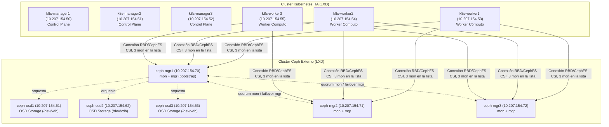

# Laboratorio K8s + Clúster Ceph Externo e Independiente sobre LXD

Este laboratorio contiene el diseño y las herramientas para desplegar e integrar un clúster de Kubernetes con un clúster de almacenamiento **Ceph Externo** e independiente, simulando un entorno empresarial donde el almacenamiento no reside dentro de Kubernetes sino en un clúster de almacenamiento físico o virtual separado.

## 💻 Requisitos del Host

Recursos que este laboratorio reserva en LXD (12 VMs: clúster k8s + clúster Ceph externo, independientes) — el host debe tener al menos esto libre, más margen para su propio sistema operativo:

| Nodos | vCPU (c/u) | RAM (c/u) | Disco raíz (c/u) | Disco Ceph (c/u) |
|-------|------------|-----------|-------------------|-------------------|
| 3 managers (k8s) | 2 | 3 GB | 20 GB | — |
| 3 workers (k8s) | 2 | 2 GB | 15 GB | — |
| 3 ceph-osd | 1 | 2 GB | 15 GB | 20 GB |
| 3 ceph-control (mon+mgr) | 1 | 2 GB | 15 GB | — |

**Total: 18 vCPU · 27 GB RAM · 255 GB disco** (+ margen recomendado para el host: 2 vCPU / 2 GB RAM / 10 GB disco libres adicionales)

## 📋 Mapeo con el Temario: "7.- CEPH"

| Punto del Temario | Implementación / Ejemplo en este Laboratorio | Fichero / Tarea |
| --- | --- | --- |
| **• Introducción** | Arquitectura desacoplada de Ceph como almacenamiento externo fuera de Kubernetes, desplegado con `cephadm` oficial. | Documentado en `README.md` |
| **• Funcionalidades** | Gestión de `ceph-osd` y de 3 nodos de control `mon`+`mgr` combinados en HA (quorum de 3 mon, mgr activo + 2 standby), pool de almacenamiento RBD `rbd-k8s`, secretos `client.admin` y Ceph Dashboard. | `10_desplegar_ceph_externo.yml` |
| **• Integración con K8S** | Integración transparente con Kubernetes mediante el controlador **Ceph-CSI** (`ceph-csi-operator` / `ceph-csi-drivers`) y la StorageClass `ceph-block-external`. | `11_integrar_k8s_ceph_externo.yml` |
| **• Comparación con Longhorn** | Comparativa de almacenamiento Ceph dedicado externo frente a soluciones hiperconvergentes / nativas K8s como Longhorn. | Documentado en `README.md` |

---
---

## 🏗️ Arquitectura del Entorno



Los 3 nodos de control de Ceph (`ceph-mgr1/2/3`) combinan `mon`+`mgr` en las mismas
máquinas — separadas de los OSD para no competir por recursos con el almacenamiento —, en
vez de 6 VMs con roles separados: es el patrón habitual en producción con cephadm, ambos son
daemons ligeros de plano de control. `ceph-mgr1` hace de nodo de bootstrap inicial (primer
mon + primer mgr); los otros dos se añaden después vía `ceph orch apply mon/mgr
--placement=...`. Con 3 mon hay quorum real (tolera la caída de 1 sin perder el clúster) y
con 3 mgr hay 1 activo + 2 standby para failover automático. El driver CSI del lado
Kubernetes también lista los 3 mon (`11_integrar_k8s_ceph_externo.yml`), no solo uno, para
no depender de un único nodo pese a que Ceph ya tenga quorum.

---

## 📋 Inventario de Nodos LXD

Las máquinas virtuales se dividen en dos grupos aislados dentro del mismo hipervisor:

| Nombre | Dirección IP | Grupo / Función | CPU | Memoria | Disco Principal | Disco OSD |
| :--- | :--- | :--- | :--- | :--- | :--- | :--- |
| **`k8s-manager1`** | `10.207.154.50` | K8s Control Plane | 2 | 3 GB | 20 GB | - |
| **`k8s-manager2`** | `10.207.154.51` | K8s Control Plane | 2 | 3 GB | 20 GB | - |
| **`k8s-manager3`** | `10.207.154.52` | K8s Control Plane | 2 | 3 GB | 20 GB | - |
| **`k8s-worker1`** | `10.207.154.53` | K8s Worker | 2 | 2 GB | 15 GB | - |
| **`k8s-worker2`** | `10.207.154.54` | K8s Worker | 2 | 2 GB | 15 GB | - |
| **`k8s-worker3`** | `10.207.154.55` | K8s Worker | 2 | 2 GB | 15 GB | - |
| **`ceph-osd1`** | `10.207.154.61` | Ceph OSD | 1 | 2 GB | 15 GB | 20 GB |
| **`ceph-osd2`** | `10.207.154.62` | Ceph OSD | 1 | 2 GB | 15 GB | 20 GB |
| **`ceph-osd3`** | `10.207.154.63` | Ceph OSD | 1 | 2 GB | 15 GB | 20 GB |
| **`ceph-mgr1`** | `10.207.154.70` | Ceph Control (mon+mgr, bootstrap) | 1 | 2 GB | 15 GB | - |
| **`ceph-mgr2`** | `10.207.154.71` | Ceph Control (mon+mgr) | 1 | 2 GB | 15 GB | - |
| **`ceph-mgr3`** | `10.207.154.72` | Ceph Control (mon+mgr) | 1 | 2 GB | 15 GB | - |

---

## ✅ Verificar la Alta Disponibilidad de Ceph (mon+mgr)

Tras `12_verificar_persistencia.yml`, el playbook `13_verificar_ha_ceph.yml` comprueba en
vivo que los 3 nodos de control (`ceph_control`) están realmente en HA: quorum de los 3
`mon`, los 3 `mgr` en ejecución, y un **failover de prueba real** (`ceph mgr fail`) que
fuerza el cambio de mgr activo y comprueba que un standby toma el relevo automáticamente. Es
solo de verificación: al terminar, restaura el mgr que estaba activo antes de ejecutarlo, así
que el clúster queda exactamente igual que lo dejó `12`.

```bash
ansible-playbook 13_verificar_ha_ceph.yml
```

---

## 🚀 Escalar el Clúster (Añadir/Quitar Nodos de forma segura)

Este escenario permite escalar de forma completamente independiente tanto la capacidad de almacenamiento (nodos OSD en el Ceph externo) como la capacidad de cómputo (workers de K8s). Son dos clústeres distintos e independientes (K8s y Ceph externo, unidos solo por el driver CSI), así que un nodo nuevo pertenece a uno u otro, nunca a ambos.

**El caso de escalado por defecto de este laboratorio es añadir capacidad de ALMACENAMIENTO** (un nuevo OSD al clúster Ceph externo): el propósito específico del escenario 05, a diferencia del 02/03/04, no es demostrar el escalado de cómputo de un clúster HA (eso ya lo cubren los escenarios anteriores), sino precisamente **cómo se monta un clúster Ceph independiente y cómo se engancha a un clúster de Kubernetes externo vía CSI**. Por eso el flujo de referencia de esta sección es el de añadir un OSD; añadir un worker K8s puro se documenta también, pero es una operación genérica ya cubierta conceptualmente en los escenarios 02-04, no el foco de este laboratorio.

El proceso está separado en dos playbooks con responsabilidades distintas, igual que en los escenarios 03 y 04:

1.  **`14_add_node.yml` — Creación de la(s) VM(s) e integración de los workers K8s.**
    Lee dos grupos del inventario, `[new_workers]` y `[new_ceph_osds]`, y con lo que
    encuentre en ellos:
    - Crea el volumen de disco OSD en LXD si el nodo lo necesita (`lxd_ceph_disk`).
    - Crea la VM en LXD (imagen base `k8s-template`, red, límites de CPU/RAM), espera a que
      el agente de LXD y el SSH estén listos, e inyecta la clave pública SSH.
    - **Si el nuevo nodo es un worker K8s** (`[new_workers]`): reutiliza los playbooks
      generales de OS/containerd/herramientas del escenario 02, genera un
      `kubeadm token create --print-join-command` en el primer manager y ejecuta
      `kubeadm join` en el nodo nuevo — queda unido al clúster K8s al terminar este mismo
      playbook.
    - **Si el nuevo nodo es un OSD Ceph** (`[new_ceph_osds]`): solo crea la VM y la registra
      en memoria (grupos `ceph_nodes`/`ceph_osds`) — deja pendiente la integración real en
      Ceph, que hace el siguiente playbook.
    - No sabe crear nodos de `ceph_control` (mon+mgr): no existe un grupo
      `[new_ceph_control]` ni lógica para ese caso (ver `PLAN.md`, "Ideas futuras").
2.  **`15_integrar_nodo_ceph_externo.yml` — Integración del nuevo OSD en el clúster Ceph externo.** Instala los requisitos (`python3`, `lvm2`) en los nuevos nodos Ceph y los da de alta en el clúster vía `cephadm` (`ceph orch host add` + escaneo de discos). **Este paso solo hace falta si has añadido nodos en `[new_ceph_osds]`**; si solo escalas cómputo K8s, no es necesario ejecutarlo.

### 1. Añadir un nodo de ALMACENAMIENTO (caso por defecto — nuevo OSD Ceph)
1. Abre `inventory.ini` y añade la línea en el grupo `[new_ceph_osds]`, especificando `lxd_ceph_disk`:
   ```ini
   [new_ceph_osds]
   ceph-osd4 ansible_host=10.207.154.64 lxd_cpu=1 lxd_mem=2GB lxd_disk=15GB lxd_ceph_disk=20GB
   ```
2. Crea la VM:
   ```bash
   ansible-playbook 14_add_node.yml
   ```
3. Intégrala en el clúster Ceph externo:
   ```bash
   ansible-playbook 15_integrar_nodo_ceph_externo.yml
   ```

### 2. Añadir un nodo de CÓMPUTO K8s (caso secundario, sin almacenamiento)
1. Abre `inventory.ini` y añade la línea en el grupo `[new_workers]` (sin `lxd_ceph_disk`, no aplica a este clúster):
   ```ini
   [new_workers]
   k8s-worker4 ansible_host=10.207.154.56 lxd_cpu=2 lxd_mem=2GB lxd_disk=15GB
   ```
2. Crea la VM y únela al clúster de Kubernetes (no hace falta ejecutar `15_integrar_nodo_ceph_externo.yml`, este nodo no es de Ceph):
   ```bash
   ansible-playbook 14_add_node.yml
   ```

### 3. Quitar Nodos

`16_eliminar_nodo.yml` es un único playbook para quitar cualquier tipo de nodo (worker K8s,
OSD Ceph o nodo de `ceph_control`) — decide qué hacer solo mirando el prefijo del nombre que
le pasas (`k8s-` o `ceph-`), no hace falta indicar el tipo aparte:

1. Ejecuta el playbook de eliminación especificando el nombre exacto del nodo:
   ```bash
   # Para eliminar un worker de K8s:
   ansible-playbook 16_eliminar_nodo.yml -e "node_name=k8s-worker3"

   # Para eliminar un OSD del clúster Ceph Externo:
   ansible-playbook 16_eliminar_nodo.yml -e "node_name=ceph-osd3"

   # Para eliminar un nodo de control Ceph (mon+mgr):
   ansible-playbook 16_eliminar_nodo.yml -e "node_name=ceph-mgr2"
   ```
2. Qué hace internamente, según el tipo de nodo:
   - **Nodo K8s** (`k8s-*`): lo drena de forma segura (`kubectl drain
     --delete-emptydir-data --ignore-daemonsets --force`), ejecuta `kubeadm reset -f` en él
     por SSH y lo borra del objeto `Node` de Kubernetes.
   - **Siempre**: destruye la VM en LXD (`lxd_container: state=absent`).
   - **Nodo Ceph** (`ceph-*`, sea OSD o de `ceph_control`): purga sus OSD si los tenía
     (`ceph osd out` + `ceph osd purge --force`), elimina el daemon `mon` si corría uno
     (`ceph orch daemon rm mon.<nodo> --force`), retira el host del orquestador
     (`ceph orch host rm --offline --force`, porque la VM ya está destruida en el paso
     anterior) y limpia su bucket vacío del CRUSH map. Borra también el volumen de disco OSD
     de LXD si existía.
   - Todos los comandos `ceph` de este bloque se **delegan por SSH a otro nodo de
     `ceph_control` que no sea el que se está borrando** (nunca al propio nodo, que ya
     puede estar destruido en ese punto) — necesario porque los 3 nodos de `ceph_control`
     tienen credenciales admin reales (etiqueta `_admin` en los 3, ver
     `10_desplegar_ceph_externo.yml`), así que cualquiera de los otros dos puede hacer la
     purga aunque el nodo de bootstrap original sea justo el que se está eliminando.
